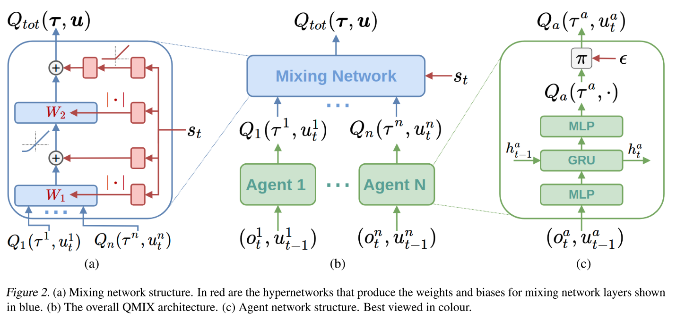
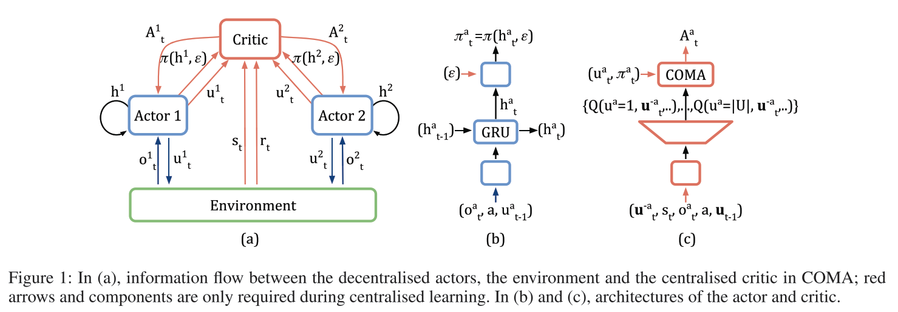

# Learning Deep Reinforcement Learning (DRL) and Multi-Agent DRL


## RL Algorithms 

### DQN Algorithm

Gradient:


Pseudo-code:


### Double DQN

### REINFORCE

### Actor-Critic

Pseudo-code:


### DDPG

Pseudo-code:


### SAC

Pseudo-code:


### TD3

Pseudo-code:


### SAC

Pseudo-code:


### RL Algorithms Interconnections


## MARL Algorithms

### IQL

The idea is simple. Just run independent RL agents in some environments. 
The main problem: nonstationarity of the world that is dependent on actions of other agents. Surprisingly, in some cases IQL works great (e.g. ping-pong env). 
In [IQL (2015)](https://arxiv.org/abs/1511.08779) paper the authors show how by playing with the reward definitions the behaviour of agents change from cooperative to competitive.


### VDN

Implicitly, the value decomposition network aims to learn an optimal linear value decomposition from the team reward signal, 
by back-propagating the total Q gradient through deep neural networks representing the individual component value functions.

This additive value decomposition is specifically motivated by avoiding the spurious reward signals that emerge in purely independent learners.
The implicit value function learned by each agent depends only on local observations, and so is more easily learned.


Basic architecture:


### QMix

QMIX is a value-based method that can train decentralised policies in a centralised end-to-end fashion. 
QMIX employs a network that estimates joint action-values as a complex non-linear combination of per-agent values that condition only on local observations. 
THe authors structurally enforce that the joint-action value is monotonic in the per-agent values, which allows tractable maximisation of the joint action-value in off-policy learning, and guarantees consistency between the centralised and decentralised policies.

Basically, QMix is like VDN but is not constrained to linear dependencies between agents' Q values.
QMix also makes use of external state of the environment.

The graphical representation of QMix NNs:




### COMA

Counterfactual Multi-Agent (COMA) is an actor-critic algorithm with a centralised critic.
Three main ideas underly COMA:
1) centralisation of the critic, 
2) use of a counterfactual baseline, and 
3) use of a critic representation that allows efficient evaluation of the baseline.

COMA also uses external state of the environment in the learning stage.

The architecture:



### DGN

- Code: [https://github.com/PKU-RL/DGN](https://github.com/PKU-RL/DGN)

The main idea is to use the underlying connection graph of agents.
No additional information about the state is not provided.

DGN consists of three types of modules: (1) observation encoder, (2) convolutional layer and (3) Q network, as illustrated in Figure 1 below. 
The local observation $o^h_i$ is encoded into a feeture vector $h^{'t}_i$ by MLP for low-dimensional input or CNN for visual input. 
The convolutional layer integrates the feature vectors in the local region (including node $i$ and its neighbors $B_i$) and generates the
latent feature vector $h^{'t}_i$. 
By stacking more convolutional layers, the receptive field of an agent gradually grows, where more information is gathered, and thus the scope of cooperation can also increase.

In the paper the experiments are done with the `MAgent` environments. 

The overview of three modules of DGN:


Computational layer (relation kernel):


Temporal relation regularization:


Code: [https://github.com/PKU-RL/DGN](https://github.com/PKU-RL/DGN)

### QTRAN

The architecture of QTRAN is as follows: 


Pseudocode: 


### IPPO
### ROMA
### MADDPG
### QPlex
### MAPPO
### Belief-PPO
### IDDPG
### SHAQ

## MARL for MAPF

### PRIMAL


## Environments

### MAgent2

- Env: [https://magent2.farama.org/](https://magent2.farama.org/)
- Paper: [https://arxiv.org/pdf/1712.00600](https://arxiv.org/pdf/1712.00600)
- Envs list: [https://github.com/Farama-Foundation/MAgent2/tree/main/magent2/environments](https://github.com/Farama-Foundation/MAgent2/tree/main/magent2/environments)

The code for parallel execution:

```python
# from magent2.environments.adversarial_pursuit import parallel_env
# from magent2.environments.battle import parallel_env
# from magent2.environments.battlefield import parallel_env
# from magent2.environments.combined_arms import parallel_env
# from magent2.environments.gather import parallel_env, raw_env
from magent2.environments.tiger_deer import parallel_env

render_mode='human'
# render_mode=None

env = parallel_env(render_mode=render_mode, max_cycles=200)
observations, infos = env.reset()

i_step = 0
while env.agents:
    # this is where you would insert your policy
    actions = {agent: env.action_space(agent).sample() for agent in env.agents}

    observations, rewards, terminations, truncations, infos = env.step(actions)

    i_step += 1
    print(f'{i_step}')
    # time.sleep(0.1)
env.close()
```

### VMAS (now is a part of BenchMARL)

- Env: [https://github.com/proroklab/VectorizedMultiAgentSimulator](https://github.com/proroklab/VectorizedMultiAgentSimulator)
- Paper: [https://arxiv.org/pdf/2207.03530](https://arxiv.org/pdf/2207.03530)

Parallel execution:

```python
import vmas

# Create the environment
env = vmas.make_env(
    # scenario="waterfall", # can be scenario name or BaseScenario class
    # scenario="dropout",
    # scenario="transport",
    # scenario="wheel",
    # scenario="drone",
    # scenario="kinematic_bicycle",
    # scenario="road_traffic",
    # scenario="multi_give_way",
    # scenario="football",
    # scenario="give_way",
    # scenario="simple",
    scenario="simple_adversary",
    num_envs=32,
    device="cpu", # Or "cuda" for GPU
    continuous_actions=True,
    max_steps=None, # Defines the horizon. None is infinite horizon.
    seed=None, # Seed of the environment
    n_agents=3  # Additional arguments you want to pass to the scenario
)
# Reset itr
obs = env.reset()

# Step it with deterministic actions (all agents take their maximum range action)
for i in range(1000):
    obs, rews, dones, info = env.step(env.get_random_actions())
    print(i)
    env.render(
        # mode="rgb_array",  # "rgb_array" returns image, "human" renders in display
        mode="human",  # "rgb_array" returns image, "human" renders in display
        # agent_index_focus=4, # If None keep all agents in camera, else focus camera on specific agent
        # index=0, # Index of batched environment to render
        # visualize_when_rgb=True,  # Also run human visualization when mode=="rgb_array"
    )
```


### SMAC - StarCraft Multi-Agent Challenge

- Env: [https://github.com/oxwhirl/smac](https://github.com/oxwhirl/smac)
- Paper: [https://arxiv.org/pdf/1902.04043](https://arxiv.org/pdf/1902.04043)

Parallel execution:

```python
from smac.env import StarCraft2Env
import numpy as np


def main():
    # env = StarCraft2Env(map_name="8m")
    # env = StarCraft2Env(map_name="2s_vs_1sc", replay_dir='/Users/perchik/PycharmProjects/Learning_DRL/saved_replays')
    env = StarCraft2Env(map_name="2s_vs_1sc")
    env_info = env.get_env_info()

    n_actions = env_info["n_actions"]
    n_agents = env_info["n_agents"]

    n_episodes = 10

    for e in range(n_episodes):
        env.reset()
        terminated = False
        episode_reward = 0

        while not terminated:
            obs = env.get_obs()
            state = env.get_state()
            # env.render()  # Uncomment for rendering

            actions = []
            for agent_id in range(n_agents):
                avail_actions = env.get_avail_agent_actions(agent_id)
                avail_actions_ind = np.nonzero(avail_actions)[0]
                action = np.random.choice(avail_actions_ind)
                actions.append(action)

            reward, terminated, _ = env.step(actions)
            episode_reward += reward

        print(f"Total reward in episode {e} = {episode_reward}")

    # env.save_replay()
    env.close()

if __name__ == '__main__':
    main()
```


## Credits

Stand on the shoulders of giants.

### General

- [OpenAI | Spinning Up in Deep RL](https://spinningup.openai.com/en/latest/index.html)
- [OpenAI | Key Papers in Deep RL](https://spinningup.openai.com/en/latest/spinningup/keypapers.html)
- [graphviz in python](https://graphviz.readthedocs.io/en/stable/index.html)

### Algorithms RL

- [PyTorch | DQN](https://pytorch.org/tutorials/intermediate/reinforcement_q_learning.html)
- [PyTorch | REINFORCE, Actor-Critic Examples](https://github.com/pytorch/examples/tree/main/reinforcement_learning)
- [Medium | DDPG](https://medium.com/geekculture/a-deep-dive-into-the-ddpg-algorithm-for-continuous-control-2718222c333e)
- [colab | PPO](https://colab.research.google.com/github/nikhilbarhate99/PPO-PyTorch/blob/master/PPO_colab.ipynb)
- [Medium | TD3](https://medium.com/geekculture/a-deep-dive-into-the-ddpg-algorithm-for-continuous-control-2718222c333e)
- [colab | SAC](https://colab.research.google.com/github/nikhilbarhate99/PPO-PyTorch/blob/master/PPO_colab.ipynb#scrollTo=Z4VJcUT2GlJz) ([github](https://github.com/nikhilbarhate99/PPO-PyTorch/blob/master/PPO.py))
- [cleanrl | SAC](https://github.com/vwxyzjn/cleanrl/blob/master/cleanrl/ppo_continuous_action.py) ([github](https://github.com/vwxyzjn/cleanrl/blob/master/cleanrl/sac_continuous_action.py))
- [Medium | SAC](https://towardsdatascience.com/soft-actor-critic-demystified-b8427df61665) ([github](https://github.com/vaishak2future/sac/blob/master/sac.ipynb))

### Algorithms MARL

- [github | DGN](https://github.com/PKU-RL/DGN)


[//]: # ()