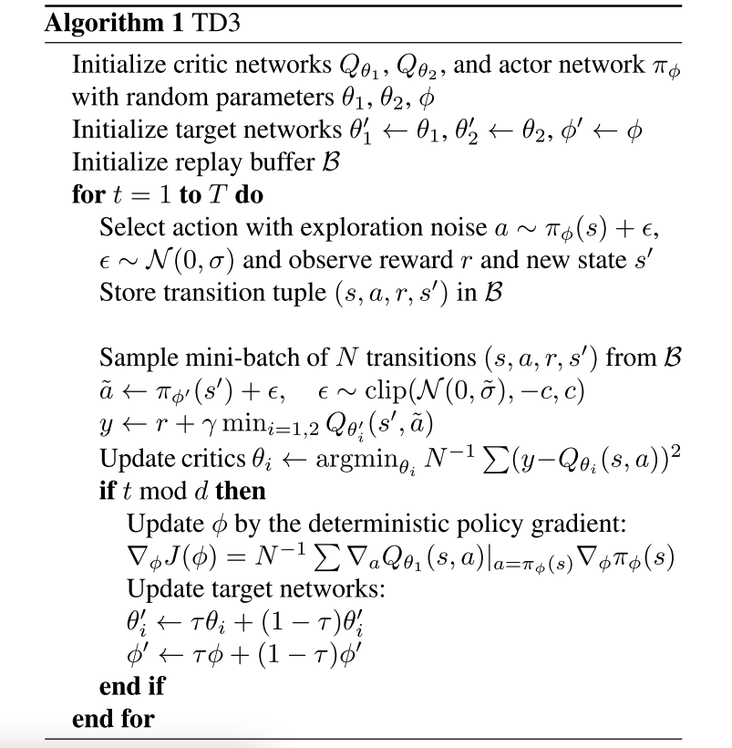

# Learning Deep Reinforcement Learning (DRL) and Multi-Agent DRL

### DQN Algorithm

Gradient:

Pseudo-code:

### Double DQN
### REINFORCE
### Actor-Critic
### TD3

Pseudo-code:

### TD3

Pseudo-code:

## Credits

- [PyTorch | DQN](https://pytorch.org/tutorials/intermediate/reinforcement_q_learning.html)
- [PyTorch | REINFORCE, Actor-Critic Examples](https://github.com/pytorch/examples/tree/main/reinforcement_learning)
- [Medium | TD3](https://medium.com/geekculture/a-deep-dive-into-the-ddpg-algorithm-for-continuous-control-2718222c333e)
- 
