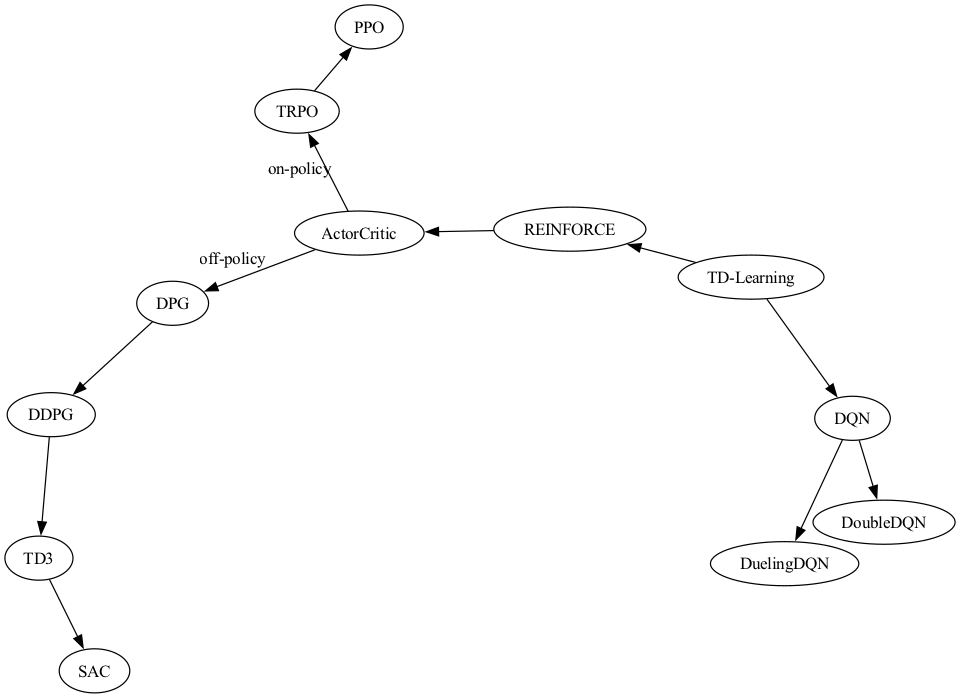

# Learning Deep Reinforcement Learning (DRL) and Multi-Agent DRL

## RL Algorithms 

### DQN Algorithm

Gradient:

Pseudo-code:

### Double DQN

### REINFORCE

### Actor-Critic

Pseudo-code:

### DDPG

Pseudo-code:

### SAC

Pseudo-code:

### TD3

Pseudo-code:

### SAC

Pseudo-code:

### RL Algorithms Interconnections

## MARL Algorithms

### IQL

The idea is simple. Just run independent RL agents in some environments. 
The main problem: nonstationarity of the world that is dependent on actions of other agents. Surprisingly, in some cases IQL works great (e.g. ping-pong env). 
In [IQL (2015)](https://arxiv.org/abs/1511.08779) paper the authors show how by playing with the reward definitions the behaviour of agents change from cooperative to competitive.

### VDN
### COMA
### QMix
### DGN
### QTRAN
### IPPO
### ROMA
### MADDPG
### QPlex
### MAPPO
### Belief-PPO
### IDDPG
### SHAQ

## MARL for MAPF

### PRIMAL

## Credits

Stand on the shoulders of giants.

### General

- [OpenAI | Spinning Up in Deep RL](https://spinningup.openai.com/en/latest/index.html)
- [graphviz in python](https://graphviz.readthedocs.io/en/stable/index.html)
- [OpenAI | Key Papers in Deep RL](https://spinningup.openai.com/en/latest/spinningup/keypapers.html)

### Algorithms RL

- [PyTorch | DQN](https://pytorch.org/tutorials/intermediate/reinforcement_q_learning.html)
- [PyTorch | REINFORCE, Actor-Critic Examples](https://github.com/pytorch/examples/tree/main/reinforcement_learning)
- [Medium | DDPG](https://medium.com/geekculture/a-deep-dive-into-the-ddpg-algorithm-for-continuous-control-2718222c333e)
- [colab | PPO](https://colab.research.google.com/github/nikhilbarhate99/PPO-PyTorch/blob/master/PPO_colab.ipynb)
- [Medium | TD3](https://medium.com/geekculture/a-deep-dive-into-the-ddpg-algorithm-for-continuous-control-2718222c333e)
- [colab | SAC](https://colab.research.google.com/github/nikhilbarhate99/PPO-PyTorch/blob/master/PPO_colab.ipynb#scrollTo=Z4VJcUT2GlJz) ([github](https://github.com/nikhilbarhate99/PPO-PyTorch/blob/master/PPO.py))
- [cleanrl | SAC](https://github.com/vwxyzjn/cleanrl/blob/master/cleanrl/ppo_continuous_action.py) ([github](https://github.com/vwxyzjn/cleanrl/blob/master/cleanrl/sac_continuous_action.py))
- [Medium | SAC](https://towardsdatascience.com/soft-actor-critic-demystified-b8427df61665) ([github](https://github.com/vaishak2future/sac/blob/master/sac.ipynb))

### Algorithms MARL

- 

[//]: # ()