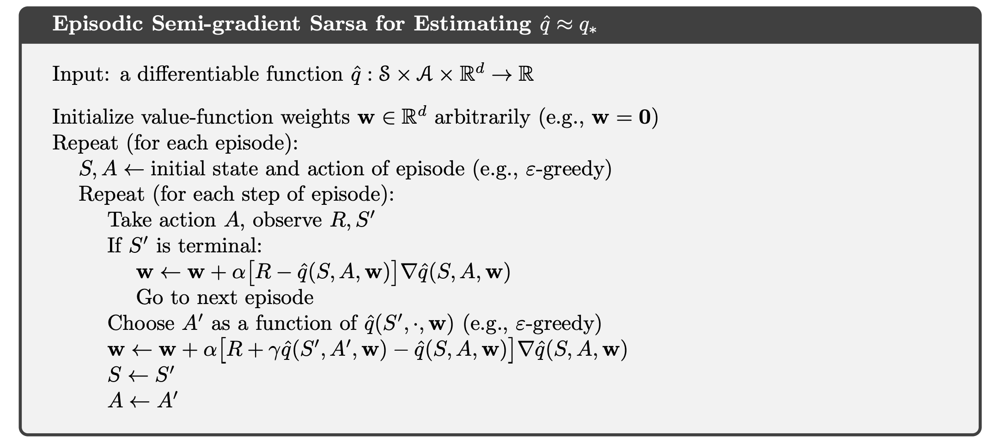
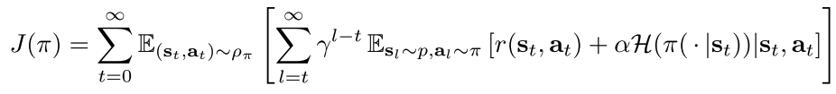
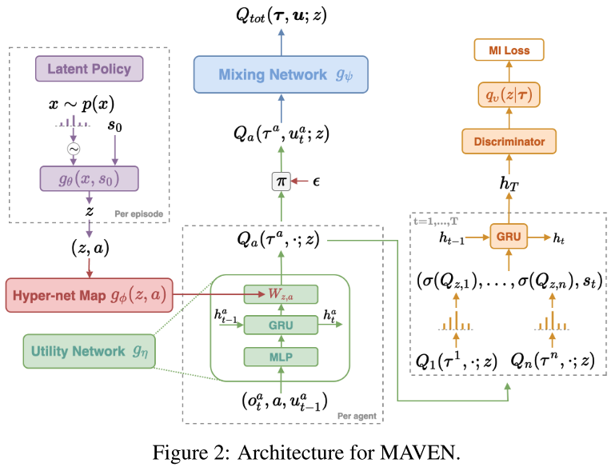

# Learning Deep Reinforcement Learning (DRL) and Multi-Agent DRL

Reinforcement Learning (RL) is a fascinating topic that captures my imagination every single time I work on it. In this repo, I try to summarise the most basic principles, ideas, and algorithms of RL and Multi-agent RL. Of course, it is impossible to mention all important steps of the development of the field. For further research I attach links to other sources that will help you with the journey. q

[//]: # (##########################################################)
[//]: # (##########################################################)
[//]: # (##########################################################)
## Reinforcement Learning Basics (Sutton & Barto RL Book and Other Sources) 

- Book: ["Reinforcement Learning: An Introduction" Richard S. Sutton and Andrew G. Barto](https://web.stanford.edu/class/psych209/Readings/SuttonBartoIPRLBook2ndEd.pdf)


### Mutli-armed Bandits 

The Mutli-armed Bandits (MAB) problem is a simplified RL problem that is stateless. Through MAB, it is easier to illustrate some basic RL principles such as exploration-exploitation principle, Reward function, etc.

Incremental formula to update average reward:


In general the updates in RL are mostly of the form:

$$NewEstimate \leftarrow OldEstimate + StepSize [ Target - OldEstimate ] $$


### Dynamic Programming

Dynamic Programming (DP) provides an essential foundation for the RL methods as those methods attempt to achive much the same effect as DP only with less computation and without assuming a perfect model of the env. Two most popular DP methods are Policy Iteration and Value Iteration are shown further.

Policy Iteration:


Value Iteration:


_Generalized Policy Iteration_ is a general idea of exchanging processes of policy evaluation and policy improvement to reach the best policy eventually:


### Monte Carlo Methods

Here we do not assume any knowledge about the world model. Pure experience-based learning. I will show here some Monte Carlo (MC) control algorithms as well.

Example 1:


Example 2:


In this chapter the authors introduced the principle of _Importance Sampling_.

$$ E_{\pi}[Tr] = \sum_{i}\pi(i) \cdot Tr(i) = \sum_{i}b(i) \cdot \frac{\pi(i)}{b(i)} \cdot Tr(i) = E_{b}[\frac{\pi}{b}Tr] $$

### Temporal Difference Learning

This is a central and novel idea that RL introduces to the world - Temporal-Difference (TD) learning.
In TD-learning the algorithms use the estimation of subsequent states in order to evaluate current state - they bootstrap.

Sarsa Algorithm:


Q-learning Algorithm:


Double Q-learning Algorithm:


_$n$-step Bootstrapping_ algorithm example:


Model-based tabular algorithm example:


### Dimensions


### RL with Approximation

One of the key differences of approximation functions from tabular methods is that here, when a singe state is updated, the change generalises from that state affect the values of many other states.
Another interesting fact is that here there are no states that will be visited twice, i.e. all states are unique. Si we need to generalise efficiently in order to find good policy.
Because of this generalisation issue the learning eventually may become faster than in tabular methods, oncw again each state-update changes the values of numerous other states.

Example:




### Policy Gradient Methods

- Code: [PyTorch | REINFORCE, Actor-Critic Examples](https://github.com/pytorch/examples/tree/main/reinforcement_learning)

A totally new approach at the time. Several advantages to the PG methods:
- can represent deterministic policies if needed
- can find stochastic policies
- simpler to approximate
- learn better policies and faster
- prior knowledge can be injected

**Policy Gradient Theorem**


Based on the theorem the basic REINFORCE algorithm was developed.
HEre the algorithm uses value function as a baseline for reducing variance during the training:


Although  the REINFORCE method can use value function as a baseline we do not consider it to be _actor-critic_, because its state-value function is used only as a baseline, not as a critic.
THat is, it is not used for bootstrapping - updating the value estimate for a state from the estimated values of subsequent states.


[//]: # (##########################################################)
[//]: # (##########################################################)
[//]: # (##########################################################)
## RL Algorithms 

### Terms 

- `credit assignment problem` - This problem is a key source of difficulty in RL that is the long time delay between actions and their positive or negative effect on rewards
- `bootstrapping` - updating the value estimate for a state from the estimated values of subsequent states

### DQN (2013)

- Paper: [Playing Atari with Deep Reinforcement Learning](https://arxiv.org/pdf/1312.05602)
- Env: Atari
- Code: [PyTorch | DQN](https://pytorch.org/tutorials/intermediate/reinforcement_q_learning.html)

DQN is the first paper that successfully adapted NN to the RL case. They are motivated by the problem of adapting NN directly on the RL tasks. Simple supervised learning is really hard for such tasks. On the other hand, it is not trivial to adapt the NN for RL algorithms as well.
To merge Q-learning together with NN into a single algorithm, the authors used two main novel ideas:

- **replay buffer**: NN love uncorrelated diverse data, and replay buffer satisfies the divergent representation of experience.
- **target $Q$ network**: the updates of $Q$ function are far more stable if the $y$ component does not change during the update. So it is better to introduce additional target $Q$ network that copies its weights to the original $Q$ network once in a while.

Gradient:


Pseudo-code:


### DPG (2014)

- Paper: [Deterministic Policy Gradient Algorithms](https://proceedings.mlr.press/v32/silver14.pdf)
- Env: envs with continuous actions
- Code: ~

DPG works with deterministic policies. It is an off-policy actor-critic algorithm. It is off-policy because we need some other exploratory policy to explore and teach our target deterministic policy.
The paper proves the deterministic policy theorem that claims, it is possible to get the gradient of deterministic policy (DPG) without knowing the state dynamics. It is similar to the stochastic policy gradient (SPG) theorem.

- DPG is a limiting case of SPG when the variance in the stochastic policy approaches 0.
- SPG integrates both over state and action spaces


- DPG integrates only over state spaces


Hence, the update rule in DPG is:


**Comparison of DPG with SPG**

DPG:
- requires fewer samples in high-dimensional action spaces
- lower variance

SPG:
- naturally explores action space
- better suited for environments where diverse actions are critical


### TRPO (2015)

- Paper & Sources: 
  - [Trust Region Policy Optimization](https://arxiv.org/pdf/1502.05477)
  - [OpenAI | TRPO](https://spinningup.openai.com/en/latest/algorithms/trpo.html)
- Env: ~
- Code: ~

Unfortunately, the paper is very complicated and requires some prior knowledge to fully understand the details of findings.
In general, the idea is that there is an algorithm that is guaranteed to improve with each step if the step-size is chosen wisely.
It takes maximum step as long as the KL divergence between the old policy and a new one is under a predefined parameter $\delta$.

A more nice short explanation can be found here: [OpenAI | TRPO](https://spinningup.openai.com/en/latest/algorithms/trpo.html).
The citation from the source is the following:
"TRPO updates policies by taking the largest step possible to improve performance, while satisfying a special constraint on how close the new and old policies are allowed to be. The constraint is expressed in terms of KL-Divergence, a measure of (something like, but not exactly) distance between probability distributions."

Discussion in [OpenAI | PPO](https://spinningup.openai.com/en/latest/algorithms/ppo.html): 
"PPO is motivated by the same question as TRPO: how can we take the biggest possible improvement step on a policy using the data we currently have, without stepping so far that we accidentally cause performance collapse? Where TRPO tries to solve this problem with a complex second-order method, PPO is a family of first-order methods that use a few other tricks to keep new policies close to old. PPO methods are significantly simpler to implement, and empirically seem to perform at least as well as TRPO."

Pseudo-code: 


### Double DQN (2016)

- Paper: [Deep Reinforcement Learning with Double Q-Learning](https://ojs.aaai.org/index.php/AAAI/article/view/10295)
- Env: 
- Code: ~

The problem this paper solves is the overestimation of action values in DQN.
The phenomenon is known as _maximisation bias_. A visual toy example:


Overestimation of some states by itself maybe not a problem, and even it sometimes helps for exploration. But if the higher values are not well distributed between actions of higher values are on those actions that we do not need to explore anymore - that is a problem.
There is a proof of theorem that, in DQN, sets the lower bound for the optimal $Q$ value estimation that is strictly bigger than optimal $V$ value of the state. THey are supposed to be equal, btw.

Double DQN replaces target $Y$ of DQN:


with the following target $Y$:


The idea behind the Double Q trick is very simple and elegant and it is a play of estimates:

$E[max_a(Q)] \neq E[Q]$ - biased

but

$E[Q(argmax_aQ'(a))] = E[Q]$ - unbiased


### Dueling DQN (2016)

- Paper: [Dueling Network Architectures for Deep Reinforcement Learning](https://proceedings.mlr.press/v48/wangf16.pdf)
- Env: [Farama | Atari Games](https://ale.farama.org/environments/)
- Code: ~

In this paper, the authors showed a nice trick to change the structure of the NNs inside already existing DRL algorithms, that provides better results.
They separated the $Q$-network from a single stream that outputs a value per each action to two separate streams for the $V$ part (state value) and $A$ parts (advantage values for every action). The illustration of the idea is presented here:


The question is how to combine the two outputs to get the required $Q$ value at the end. The naive approach to sum the $V$ and $A$ parts does not work. The authors say that this way the effect of separation cancels out.
So the alternative is to subtract from the advantage values the maximum $A$ value or.. the average of $A$ values as here:


Note that $Q(s, a*) = V(s,a*)$ and $A(s, a*) = 0$, where $a*$ is the best action. That's why the formula makes sense.

The great part of this new trick is that it naturally provides two following advantages:

1. **The $V$ part is updated with every $Q$ update in the dueling schema, unlike previous approaches:** "The dueling architecture has an ability to learn the state-value function efficiently. With every update of the Q values in the dueling architecture, the value stream $V$ is updated – this contrasts with the updates in a single-stream architecture where only the value of one actions is updated, the values for all other actions remain untouched. This more frequent updating of the value stream allocates more resources to $V$, and thus allows for better approximation of the state values, which need to be accurate for temporal-difference-based methods like $Q$-learning to work (Sutton & Barto, 1998). This phenomenon is reflected in the experiments, where the advantage of the dueling architecture over single-stream $Q$ networks grows when the number of actions is large."
2. **Dueling separation helps to distinguish between small differences in action values:** "The differences between $Q$-values for a given state are often very small relative to the magnitude of $Q$. For example, after training with DDQN on the game of Seaquest, the average action gap (the gap between the Q values of the best and the second best action in a given state) across visited states is roughly 0.04, whereas the average state value across those states is about 15. This difference in scale means that small amount of noise in the updates could reorder the actions, and thus making the nearly greedy policy switch abruptly. The dueling architecture with its separate advantage stream is robust to such effects."

### Actor-Critic (2016)

- Paper: [Asynchronous Methods for Deep Reinforcement Learning](https://proceedings.mlr.press/v48/mniha16.pdf)
- Code: [PyTorch | REINFORCE, Actor-Critic Examples](https://github.com/pytorch/examples/tree/main/reinforcement_learning)


Although REINFORCE algorithm may use $V$ as a baseline, it is not considered to be the _actor-critic_ algorithm, because its $V$ is used as a baseline and not used for bootstrapping (updating the value estimate for a state from the estimated values of subsequent states).
This change accelerates learning drastically.
So the core idea is that the actor-critic methods incorporate $V$ function into the estimation of values states themselves.
The simplest example from the Sutton's book:


The full pseudo-code with the use of NNs:


### DDPG (2016)

- Paper: [CONTINUOUS CONTROL WITH DEEP REINFORCEMENT LEARNING](https://arxiv.org/pdf/1509.02971)
- Env: Mujoco
- Code: [Medium | DDPG](https://medium.com/geekculture/a-deep-dive-into-the-ddpg-algorithm-for-continuous-control-2718222c333e)

The core idea of the paper is to adapt actor-critic method to the _continuous action domain_.
It is impossible to naively adapt the discrete approaches because of the _curse of dimensionality_ issue.
The contribution of the paper is to adapt nice theoretically robust DPG algorithm to work with NNs and to be able to tackle much complex problems.
The tricks are:
- **use replay buffer**: as in DQN to break the correlation between subsequent states and stabilise NN learning
- **usage of a target $Q$ function with soft updates**: also similar to the DQN trick. Here, though,  the soft update is a novelty that is well adapted by other subsequent algorithms.
- **batch normalisation**: here the problem that the batch normalisation solves is to force the feature from the environment to be at the same range/scale. It is hard to NN to learn when one feature jumps from minus million to plus million and other feature is between $[-1, 1]$. Let's convert all to be inside the same range of numbers +-.
- **exploration policy**: DDPG is an off-policy algorithm, so it is really easy to add exploration to the execution policy. The authors use some kind of noise that they add the to action sampling process.

The full pseudo-code:


### GAE (2016)

- Paper: [HIGH-DIMENSIONAL CONTINUOUS CONTROL USING GENERALIZED ADVANTAGE ESTIMATION](https://arxiv.org/pdf/1506.02438)
- Code: ~

The idea of GAE is to implement $TD(\lambda)$ ideas on the advantage values instead of state-values.
As in $TD(\lambda)$, GAE helps to balance between variance and bias of advantage values. 
Here is the formulation of GAE:


The usage of GAE is primarily in policy optimization algorithms (PPO, TRPO, etc.) to reduce variance without adding to much bias.

### PPO (2017)

- Paper: [Proximal Policy Optimization Algorithms](https://arxiv.org/pdf/1707.06347)
- Env: Mujoco
- Code: [colab | PPO](https://colab.research.google.com/github/nikhilbarhate99/PPO-PyTorch/blob/master/PPO_colab.ipynb)

Basically, PPO is a simplified version of the TRPO algorithm that is much easier to implement.

The most important formula is the _surrogate_ objective of PPO:


The final objective is a **lower bound** of the unclipped objective:
- if the value is very low, it will take $-rA$
- if the value is slightly low (less than $1 - \epsilon$), it will take $-(1 - \epsilon)A$
- if the value is slightly positive, it will take the original $+rA$
- if the value is much positive (greater than $1 + \epsilon$), it will take $+(1 + \epsilon)A$

Pseudo-code:


In the paper, they compared different variations of surrogate functions but found that the aforementioned is the best one.
Unfortunately, no discussion about why this choice of objective is logical provided in the paper.
Fortunately, we have ChatGPT, and I talked a bit with it about the topic. The following important intuition is emerged..

The nature of bad actions and good action is not the same. These are fundamentally different and the asymmetry to dealing with bad and good actions is required.
- **be harsh on bad actions**: aggressively cutting bad actions quickly removes harmful choices and does not risk loosing anything valuable
- **be cautious on good actions**: limiting how much you amplify good actions avoids premature convergence (overfitting) and maintains a healthier level of exploration

This insight is quite striking, because it resembles us and animals and how we approach learning. Kalman and Tversky also discovered that humans treat $x$ units of loss much stronger than the same $x$ units of happiness.


### HER (2017)

- Paper:
- Env:
- Code: 

### TD3 (2018)

- Paper: [Addressing Function Approximation Error in Actor-Critic Methods](https://proceedings.mlr.press/v80/fujimoto18a/fujimoto18a.pdf)
- Env: Mujoco
- Code: 
  - [github | original implementation](https://github.com/sfujim/TD3)
  - [Medium | TD3](https://medium.com/geekculture/a-deep-dive-into-the-ddpg-algorithm-for-continuous-control-2718222c333e)

The authors point out the problem of value overestimation bias (like in Double DQN) but for continuous actions.
A naive adaptation of Double Q-learning ((1) to use target function as the second function or (2) to train the whole separate Q function in parallel) does not work due to slow-changing policy in an actor-critic setting. The target and current policy are too similar to each other. If we chose to train two q functions in parallel, there is too much noise in the actor-critic setting that still brings the bias back.

The authors propose _Twin Delayed Deep Deterministic policy gradient algorithm (TD3)_.
They prove why overestimation bias in Actor-Critic exists. I will elabore the proof here, because it is simple and nice to understand.
The authors show that when using deterministic policy gradient, even if there is no bias in the estimations, the overestimation still will occur. Note, **the gradient direction is a local maximizer**.

First, logical to assume that an approximate policy tuned for its Q function will get higher values than even the perfect policy:

$$ E[Q_{\theta}(s, \pi_{approx}(s))] \geq E[Q_{\theta}(s, \pi_{true}(s))] $$

Of course, the true Q values of the tru function are greater than the approximate one:

$$ E[Q^{\pi}(s, \pi_{true}(s))] \geq E[Q^{\pi}(s, \pi_{approx}(s))] $$

Because of the maximization operation (gradient direction), so the approximate critic will give higher values to the true policy than the tru critic:

$$ E[Q_{\theta}(s, \pi_{true}(s))] \geq E[Q^{\pi}(s, \pi_{true}(s))] $$

So, that means the overestimation is inevitable. Combining three inequalities we get:

$$ E[Q_{\theta}(s, \pi_{approx}(s))]  \geq E[Q^{\pi}(s, \pi_{approx}(s))]. \square$$

The authors solve the bias problem with the following target update of the Clipped Double Q-learning algorithm:


- The idea is that even if values are underestimated they will not propagate through NN like the overestimated values.
- Minimum operator prefers states with lower variance. Less variance, less differences between two Q functions.

The authors reduce variance also by slowly updating the policy: $\theta' = \tau \theta + (1 - \tau)\theta'$.

To prevent overfitting of policy, the authors add a random noice to the action selection:

$$ a \leftarrow \pi_{\phi}(s) + \epsilon, \: \epsilon \sim clip(N(0, \sigma), -c, c) $$

Pseudo-code:


In short, they took DDPG and:
- Added a new critic NN
- Introduced the minimum operator to the target calculation
- Made updates smoother
- Added noise to the action selection process
- Utilises deterministic policy gradient (DPG) update through $Q$ function

And by that got SOTA results.


### SAC (2018)

- Papers & Sources: 
  - [paper | Soft Actor-Critic: Off-Policy Maximum Entropy Deep Reinforcement Learning with a Stochastic Actor](https://proceedings.mlr.press/v80/haarnoja18b/haarnoja18b.pdf)
  - [paper | ACTOR LOSS OF SOFT ACTOR CRITIC EXPLAINED](https://arxiv.org/pdf/2112.15568)
  - [youtube | Entropy, Cross-Entropy and KL-Divergence](https://www.youtube.com/watch?v=ErfnhcEV1O8)
  - [wiki | Kullback–Leibler divergence](https://en.wikipedia.org/wiki/Kullback%E2%80%93Leibler_divergence)
  - [youtube | Reparameterization Trick](https://www.youtube.com/watch?v=xL1BJBarzWI)
  - [OpenAI | SAC](https://spinningup.openai.com/en/latest/algorithms/sac.html)
- Env: Mujoco
- Code:
  - [Medium | TD3](https://medium.com/geekculture/a-deep-dive-into-the-ddpg-algorithm-for-continuous-control-2718222c333e)
  - [colab | SAC](https://colab.research.google.com/github/nikhilbarhate99/PPO-PyTorch/blob/master/PPO_colab.ipynb#scrollTo=Z4VJcUT2GlJz) ([github](https://github.com/nikhilbarhate99/PPO-PyTorch/blob/master/PPO.py))
  - [cleanrl | SAC](https://github.com/vwxyzjn/cleanrl/blob/master/cleanrl/ppo_continuous_action.py) ([github](https://github.com/vwxyzjn/cleanrl/blob/master/cleanrl/sac_continuous_action.py))
  - [Medium | SAC](https://towardsdatascience.com/soft-actor-critic-demystified-b8427df61665) ([github](https://github.com/vaishak2future/sac/blob/master/sac.ipynb))

The previous methods have very high sample complexity (they require a lot of iterations to learn), like on-policy PPO, TRPO, or they are very sensitive to hyperparameters' changes, like an off-policy DDPG, TD3.

This paper presents the _maximum-entropy RL_ framework.
The main principle of this framework: **to succeed at the task while acting as randomly as possible**.
The objective of the maximum-entropy RL is:


For discounted case:



The conventional RL objective can be recovered if $\alpha=0$.
The advantages of the new objective are:
- the policy explored more widely
- the policy captures more similar optimal behaviours

In order to derive the gradient for the policy network, the authors first used KL divergence to build the following estimator:


Then, they used the reparametrization trick to simplify the gradient propagation and to reduce the sampling from it completely:


**Reparametrization Trick**:
The idea is as follows. You can sample a random variable from the parametrized distribution, let's say $a \sim N(\mu, \sigma)$, or to simple sample $\epsilon \sim N(0, 1)$ nad to apply the transformation $a = \mu + \sigma\epsilon$. In the second case, there is no need to calculate gradient for the distribution.

The authors also used the findings of TD3 algorithm, and used the min of two $Q$ functions.

Pseudo-code:


So, SAC:
- Uses entropy inside its $Q$ functions to improve exploration
- Utilises Replay Buffer to improve sample efficiency
- Uses KL Divergence + Reparametrization Trick to traint policy
- Utilises two $Q$ functions to get rid of positive bias, as in TD3
- Uses an actor-critic setting
- Utilises deterministic policy gradient (DPG) update through $Q$ function


### DreamerV3 (2023)

- Paper: [Mastering Diverse Domains through World Models](https://arxiv.org/pdf/2301.04104v2)
- Env: Atari, ProcGen, DMLab, Atari100k, Proprio Contral, Visual Control, BSuite, Minecraft
- Code: [jax implementation (official)](https://danijar.com/project/dreamerv3/), [pytorch implementation](https://github.com/NM512/dreamerv3-torch?utm_source=chatgpt.com)

DreamerV3 is a model-based RL algorithm that achieves SOTA results on many different domains, such as computer games, physics simulators, and other complex environments.
The overall structure is as follows:

1. the world model predicts the outcomes of potential actions ->
2. the critic judges the value of each outcome ->
3. the actor chooses actions to reach the most valuable outcomes

Very simple. The majority of the paper is focused on adapting this algorithm to the 150 very diverse environments with a million tricks. The reason for that is that they want to build a single NN configuration (same NN weights) that will work everywhere.
Unfortunately, the authors did not point out exactly was the algorithm so successful. Is it the scale? Is it the fact that the algorithm is model-based? Is it because numerous tricks for stabilisation? Or all of them combined?
From my impression, the model of the world is the most critical part. If you can construct the world-model properly - it can benefit you a lot, as it is shown in the paper.

THe overall schema of DreamerV3:


> A perfect example for a paper that has a highly complex algorithm, but described lightly. After reading the paper you actually ending up with a feeling that you are smart and not stupid. And the code is open.


### RL Algorithms Interconnections


--- 


[//]: # (##########################################################)
[//]: # (##########################################################)
[//]: # (##########################################################)
## MARL Algorithms

### Terms

- `non-stationary` - each agent’s policy is changing as training progresses, and the environment becomes non-stationary from the perspective of any individual agent (in a way that is not explainable by changes in the agent’s own policy)
- `CTDE` - centralised training decentralised execution
- `IGM (Individual-Global-Max)` - To enable effective CTDE for multi-agent Q-learning, it is critical that the joint greedy action should be equivalent to the collection of individual greedy actions of agents, which is called the IGM (Individual-Global-Max) principle (Son et al., 2019).

### IQL (1993, 2015)

- Paper (1993): [https://citeseerx.ist.psu.edu/document?repid=rep1&type=pdf&doi=b3fc56876ad1cdf35ad4af13b991bbb24d219bd9](https://citeseerx.ist.psu.edu/document?repid=rep1&type=pdf&doi=b3fc56876ad1cdf35ad4af13b991bbb24d219bd9)
- Paper (2015): [https://proceedings.mlr.press/v70/foerster17b/foerster17b.pdf](https://proceedings.mlr.press/v70/foerster17b/foerster17b.pdf)
- Env: Pong video-game
- Code: ~
- My Code: [alg_IQL.py](algs_MARL/alg_IQL.py)

The idea is simple. Just run independent RL agents in some environments. 
The main problem: nonstationarity of the world that is dependent on actions of other agents. Surprisingly, in some cases IQL works great (e.g. ping-pong env). 
In [IQL (2015)](https://arxiv.org/abs/1511.08779) paper the authors show how by playing with the reward definitions the behaviour of agents change from cooperative to competitive.


### VDN (2017)

- Paper: [https://arxiv.org/pdf/1706.05296](https://arxiv.org/pdf/1706.05296)
- Env: ~
- Code: ~
- My code: [alg_VDN.py](algs_MARL/alg_VDN.py)


The paper is first to introduce the value decomposition principle. It does so with the additive approach (which means just to sum all Q values), namely $\sum_{i} Q_i$.
The general motivation for the paper is fact the in fully centralised or fully decentralised systems there can be many cases when agents see spurious (fake, false) rewards, created by other agents but not by the actions of the given agent. So the agent is motivated by false signals and its learned policy is not adequate for its actual actions' influence on the world.
So any logical value decomposition solves the issue; they chose a summation. Others, as we see further, chose more sophisticated methods of factorisation.

The $Q$ function is created as follows:


Basic architecture:


### IAC and COMA (2018)

- Paper: [Counterfactual Multi-Agent Policy Gradients](https://ojs.aaai.org/index.php/AAAI/article/view/11794)
- Env: [SMAC](https://github.com/oxwhirl/smac/tree/master)
- Code: ~

Counterfactual Multi-Agent (COMA) is an actor-critic algorithm with a centralised critic.
Three main ideas of the COMA algorithm:
1) centralisation of the critic, as in all CTDE algorithms 
2) use of a counterfactual baseline
3) use of a critic representation that allows efficient evaluation of the baseline

The idea of _counterfactual baseline_ is what is beautiful in this paper.
Once again, as we said in the VDN part, the credit assignment is tricky in MARL. So one way to solve it, as COMA suggests, is to subtract from $Q_{tot}$ given agent's specific action $u^{a}$ the $Q_{tot}$ value where agent uses some other action $u^{'a}$. The formula is as follows:


Then, COMA suggests a cleaver and simple architecture of the NN to efficiently get all the necessary values fast to calculate all these counterfactual baselines for every agent.
The architecture:


One of the baseline algorithms they used is Independent Actor-Critic (IAC) algorithm, that is just to use the same NN for actor and for critic for all agents but pretend that the learning is decentralized (the updates of the NNs are conditioned only on the local action-observation history of each agent).
COMA can also use external state of the environment in the learning stage.
Other papers, such as QMIX paper, say that COMA scales purly with the number of agents and learns slowly.


### QMIX (2018)

- Paper: [QMIX: Monotonic Value Function Factorisation for
Deep Multi-Agent Reinforcement Learning](https://www.jmlr.org/papers/volume21/20-081/20-081.pdf)
- Env: [SMAC](https://github.com/oxwhirl/smac/tree/master)
- Code: ~

QMIX is a value-based method that can train decentralised policies in a centralised end-to-end fashion. 
QMIX employs a network that estimates joint action-values as a complex non-linear combination of per-agent values that condition only on local observations.
The authors structurally enforce that the joint-action value is monotonic in the per-agent values, which allows tractable maximisation of the joint action-value in off-policy learning, and guarantees consistency between the centralised and decentralised policies.

In simple terms, the authors claim that for consistency of local $Q_i$ values with the big $Q_{tot}$ value, it is sufficient to ensure that global _argmax_ yields the same result as local _argmax_ operations:


The paper claims that this type of requirement makes $Q_{tot}$ "trivially" tractable. Why it's so trivial, idk.
Though VDN is sufficient to satisfy the aforementioned requirement, QMIX is open to a larger set of policies. Monotonicity can be enforced through a following constraint:


So that is why in the mixing part of the framework you can see that the values are in absolute terms for weights (not for biases).
The graphical representation of QMIX NNs:


Monotonicity here, as far as I understand, is the fact that if I remove any agent from constraint the  $Q_{tot}$ function will necessarily or decrease or at list remain the same.


Basically, QMIX is like VDN but is not constrained to linear dependencies between agents' Q values.
QMIX also might use external state of the environment.
The QMIX may represent monotonic value function but is unable to present non-monotonic payoff functions. Intuitively, any value function for which agent's best action depends on the action of any other agent at the same time step cannot be factorised appropriately by QMIX.
An example for both types of functions:


### QTRAN (2019)

- Paper: [QTRAN: Learning to Factorize with Transformation for Cooperative Multi-Agent Reinforcement Learning](https://proceedings.mlr.press/v97/son19a/son19a.pdf)
- Env: custom
- Code: [https://github.com/himelbrand/marl-qtran](https://github.com/himelbrand/marl-qtran)

Also value-based algorithm like VDN and QMIX.
VDN addresses linear correlation of $Q$ values, QMix assume monotonicity.
Hence, VDN and QMIX address only a fraction of factorisable MARL tasks due to their structural constraint in factorization such as additivity and monotonicity. 
QTRAN is a new factorization method for MARL, which is free from such structural constraints and takes on a new approach to transforming the original joint action-value function into an easily factorisable one, with the same optimal actions.

The authors that to preserve the property described in the QMIX section:


Also known as Individual-Global-Max (IGM) property.
it is possible to construct factorization and to preserve _IGM_ with even less restrictive constraints. It is sufficient to make sure that the sum of optimal $Q_i$ functions is equal to the optimal $Q_{tot}$:


A toy example where QTRAN is better than VDN and QMix:


The architecture of QTRAN is as follows: 


Pseudocode: 


The algorithm is complex but has same nice theoretical properties.


### MAVEN (2019)

- Paper: [MAVEN: Multi-Agent Variational Exploration](https://proceedings.neurips.cc/paper/2019/file/f816dc0acface7498e10496222e9db10-Paper.pdf)
- Env: [SMAC](https://github.com/oxwhirl/smac/tree/master)
- Code: ~

Though, I do not understand the full details of the approach, I try here t odescribe the general idea of the paper. MAVEN introduces additional tricks to QMIX that allows it to use some latent space to coordinate agents better and to align their choices. The overall schema is:


Pseudo-code:


### DGN (2020)

- Paper: [GRAPH CONVOLUTIONAL REINFORCEMENT LEARNING](https://arxiv.org/pdf/1810.09202)
- Env: [MAgent2](https://magent2.farama.org/)
- Code: [https://github.com/PKU-RL/DGN](https://github.com/PKU-RL/DGN)

The main idea is to use the underlying connection graph of agents.
No additional information about the state is provided.

DGN consists of three types of modules:
1. observation encoder - a simple MLP or CNN, depending on the input from an env.
2. convolutional layer - attention heads that connect an agent with its neighbours
3. Q network - concatenates everything into a single value per agent

The local observation $o^h_i$ is encoded into a feature vector $h^{'t}_i$ by MLP for low-dimensional input or CNN for visual input. The convolutional layer integrates the feature vectors in the local region (including node $i$ and its neighbors $B_i$) and generates the latent feature vector $h^{'t}_i$. By stacking more convolutional layers, the receptive field of an agent gradually grows, where more information is gathered, and thus the scope of cooperation can also increase.
The overview of three modules of DGN:


Computational layer (relation kernel):


Temporal relation regularization:


The main trick here is the very construction of the NN arrangement which forces agents to cooperate only with their neighbour circle. And its changing adjacency matrices allows dynamic interaction when agents can move and change neighbours all the time.

### IPPO (2022)

- Paper: [Is Independent Learning All You Need in the StarCraft Multi-Agent Challenge?](https://arxiv.org/pdf/2011.09533)
- Env: [SMAC](https://github.com/oxwhirl/smac/tree/master)
- Code: ~

Each agent `a` learns a local observation based critic $V_φ(z^a_t)$ parameterised by $φ$ using Generalized Advantage Estimation (GAE).
The network parameters $φ, θ$ are shared across critics, and actors, respectively.
The authors also add an entropy regularization term to the final policy loss.
For each agent, the overall learning loss becomes:


The architecture is three `conv1d` layers and two MLP layers.

The algorithm outperforms QMIX and others on the SMAC env.
It seems that IPPO's (approximate) surrogate objective might mitigate certain forms of environment non-stationary nature that other independent learning algorithms are prone to, e.g., by suppressing updates catastrophic to performance.

> In general, the idea is that IL is somehow surprisingly can be ok. The authors are unsure exactly why is that a case, probably because of the magic of the PPO's surrogate objective. In the paper, the authors used a very complicated language.


### ROMA (2020)

- Paper: [ROMA: Multi-Agent Reinforcement Learning with Emergent Roles](https://arxiv.org/pdf/2003.08039)
- Env: [SMAC](https://github.com/oxwhirl/smac/tree/master)
- Code: ~

The paper introduces a concept of _role_ into MARL. 
The idea is that this concept will allow to agents to specialize in their specific tasks and hence improve performance. The trick is that many agents have similar roles, so they can enjoy from mutual learning. But how to distinguish between different roles, so that non-related agent will not disturb others?
The authors define three properties that are important for every role: (1) it needs to be dynamic to the changes of an env; (2) it needs to identifiable, i.e. to be temporary stable, so that the behaviour is consistent with time; (3) it needs to be specialized so that different robots can identify each other's roles and to be able to learn from agents with similar roles.
So the ROMA works as follows (plus-minus): it encodes the trajectory into role, composes the loss for _identifiable_ property. Then, it computes the loss for _specialized_ property. Then, it uses the QMIX loss for the $Q_{tot}$. After the reword is generated the gradients propagate back.

> The method achieved SOTA results on the SMAC benchmark. That is good. But the disadvantage is that the method is relatively complicated. There are 5 learnable different NNs, the loss function is complex, and there are many parameters. Maybe that is why ROMA is not used as a benchmark in the papers that came afterword.


### MADDPG (2020)

- Paper: [Multi-Agent Actor-Critic for Mixed
Cooperative-Competitive Environments](https://proceedings.neurips.cc/paper/2017/file/68a9750337a418a86fe06c1991a1d64c-Paper.pdf)
- The env they used: [PettingZoo - MPE](https://pettingzoo.farama.org/environments/mpe/)
- Code: ~

In this paper, the authors adapt DDPG to the multi-agent case.
They describe the same problems of non-stationary and that it is tricky to use memory buffer in the multi-agent case.
Their trick is that there is a separate $Q_i$ function for every agent $i$. And each such function sees the actions, observations and, potentially, policies of other agents. They also describe how to approximate policies of other agents using only their observations.
Another trick for competitive environments is to preserve several policies for every agent and to switch between them randomly during both the training and the execution.
The schema of the algorithms is in the following pic:


The pseudo-code of MADDPG is as follows:


The paper presented no theoretical guarantees.
A really well-written paper, I should say.

### Qatten (2020)

- Paper: [Qatten: A General Framework for Cooperative Multiagent Reinforcement Learning](https://arxiv.org/pdf/2002.03939)
- Env: [SMAC](https://github.com/oxwhirl/smac/tree/master)
- Code: ~

This paper generalizes the VDN, QMIX, and QTRAN findings. They all use some combination of $Q_i$ values to compose the $Q_{tot}$ function.
The Qatten paper generalizes the idea in the following Theorem:


Basically, it says that, given every state $s$, there are some linear combinations of $Q$ values that properly describe $Q_{tot}$.
Then they presented the approximation for this ideal$Q_{tot}$ in order to construct an algorithm: 


An the overall algorithm schema is presented here:


The achieved SOTA results at the time. They used multi-head attention as the ultimate approximator for the $\lambda$ values, referring to this paper: ["ARE TRANSFORMERS UNIVERSAL APPROXIMATORS OF SEQUENCE-TO-SEQUENCE FUNCTIONS?" (ICLR, 2020)](https://arxiv.org/pdf/1912.10077).
The details of the formulas are hard to track, unfortunately.


### QPlex (2021)

- Paper: [QPLEX: DUPLEX DUELING MULTI-AGENT Q-LEARNING](https://arxiv.org/pdf/2008.01062)
- Env: [SMAC](https://github.com/oxwhirl/smac/tree/master)
- Code: ~

This paper defines advantage-based IGM (_individual global max_) principle and bridges it with the original IGM principle. This principle was used by previous algorithms such as VDN, QMIX, and QTRAN. There, they said that the combination of individual $Q$ values compose the total $Q$ value. So, in this paper, the authors declare that it is more beneficial to look at the advantage values $A$ instead of $Q$ values. The inspiration is taken from the "Dueling DQN" paper (explained earlier).
Not only that, the paper also took inspiration from "Qatten" paper to combine the $A$ values in a cleaver manner.
The overall flow of the algorithm is here: 


The bad news, once again as in "Qatten" paper, the approach is complex and it is hard to fully understand the theoretical strength of the paper.

They took the smart combination of $Q$ values from "Qatten" paper, attention mechanism, duelling trick from the "Dueling DQN" paper and smashed it all together on top of the MARL problem and it worked.

### MAPPO (2022)

- Paper: [The Surprising Effectiveness of PPO in Cooperative Multi-Agent Games](https://proceedings.neurips.cc/paper_files/paper/2022/file/9c1535a02f0ce079433344e14d910597-Paper-Datasets_and_Benchmarks.pdf)
- Env: [SMAC](https://github.com/oxwhirl/smac/tree/master), [Google Research Football](https://github.com/google-research/football), [Hanabi](https://pettingzoo.farama.org/environments/classic/hanabi/), [MPE](https://pettingzoo.farama.org/environments/mpe/)
- Code: [https://github.com/marlbenchmark/on-policy](https://github.com/marlbenchmark/on-policy)

Basicalle, MAPPO works exactly like PPO.
There is a common value function. The policy function may be common, if agents are similar, or different for every agent. The value function may use some global state info.
When the authors implemented MAPPO, they wanted to point out the following 5 main advises for the implementation:

1. **value normalisation**: Utilize value normalization to stabilize value learning. Keep track of averages and variances.
2. **input representation to $V$ function**: use global data if applicable. Do not duplicate data.
3. **training data usage**: do not overtrain on the batch.
4. **PPO clipping**: very important - do the clipping. 0.2 worked well for them.
5. **batch size**: use big batches for better performance.


The pseudo-code from the paper:


### Belief-PPO (2023)

- Paper: [Dynamic Belief for Decentralized Multi-Agent Cooperative Learning](https://www.ijcai.org/proceedings/2023/0039.pdf)
- Env: [SMAC](https://github.com/oxwhirl/smac/tree/master)
- Code: ~

Ok, here the setting is full decentralised. As far as I understand, they use beliefs (embedded policy approximations) of other agents to cover for the non-stationary problem. The authors use history of observations of other agents to infer their behaviour.
Once again, the problem, imo, is that the approach, though achieves SOTA results, is very complex for simple peoples like me to quickly implement. Not trivial how to adjust all those NNs and attention mechanism. No code from authors neither. The paper uses a bit high language which complicated understanding. The formulas lack intuitive explanations. But the idea is nice, that is why the paper here.

Here is the general structure of Belief-PPO:


### SHAQ (2023)

- Paper: [https://proceedings.neurips.cc/paper_files/paper/2022/file/27985d21f0b751b933d675930aa25022-Paper-Conference.pdf](https://proceedings.neurips.cc/paper_files/paper/2022/file/27985d21f0b751b933d675930aa25022-Paper-Conference.pdf)
- Env: [SMAC](https://github.com/oxwhirl/smac/tree/master)
- Code: [https://github.com/hsvgbkhgbv/shapley-q-learning](https://github.com/hsvgbkhgbv/shapley-q-learning)


A simple example that describes Shapley Value principle from ChatGPT (hope it is correct):

```txt
Simple Example with Numbers
Let's take a small example with two players: Alice and Bob.

- Alice alone can make $100.
- Bob alone can make $50.
- Together, they make $200.

The question is: how much did each contribute to the extra value created when they work together?

- If Alice joins first, she contributes $100, then Bob joins and increases the total from $100 to $200, so his contribution is $100.
- If Bob joins first, he contributes $50, then Alice joins and increases the total from $50 to $200, so her contribution is $150.

Averaging these two cases:

- Alice's Shapley value = (100+150)/2=125.
- Bob's Shapley value = (50+100)/2=75.

So, a fair split of the $200 profit is Alice = $125, Bob = $75.
```

The SHAQ paper the Shapley value principle to the fair division of reward in MARL case and achieves SOTA results, of course.
The additional nice advantage is that with SHAQ we have some explainability of the reward distribution between agents.

Pseudo-code: 


As you can see the implementation is also not so simple. At list, they have code to play with in GitHub.

---

[//]: # (##########################################################)
[//]: # (##########################################################)
[//]: # (##########################################################)
## MARL for MAPF

### PRIMAL

[//]: # (##########################################################)
[//]: # (##########################################################)
[//]: # (##########################################################)
## Environments

### MAgent2

- Env: [https://magent2.farama.org/](https://magent2.farama.org/)
- Paper: [https://arxiv.org/pdf/1712.00600](https://arxiv.org/pdf/1712.00600)
- Envs list: [https://github.com/Farama-Foundation/MAgent2/tree/main/magent2/environments](https://github.com/Farama-Foundation/MAgent2/tree/main/magent2/environments)

The code for parallel execution:

```python
# from magent2.environments.adversarial_pursuit import parallel_env
# from magent2.environments.battle import parallel_env
# from magent2.environments.battlefield import parallel_env
# from magent2.environments.combined_arms import parallel_env
# from magent2.environments.gather import parallel_env, raw_env
from magent2.environments.tiger_deer import parallel_env

render_mode='human'
# render_mode=None

env = parallel_env(render_mode=render_mode, max_cycles=200)
observations, infos = env.reset()

i_step = 0
while env.agents:
    # this is where you would insert your policy
    actions = {agent: env.action_space(agent).sample() for agent in env.agents}

    observations, rewards, terminations, truncations, infos = env.step(actions)

    i_step += 1
    print(f'{i_step}')
    # time.sleep(0.1)
env.close()
```

### VMAS (now is a part of BenchMARL)

- Env: [https://github.com/proroklab/VectorizedMultiAgentSimulator](https://github.com/proroklab/VectorizedMultiAgentSimulator)
- Paper: [https://arxiv.org/pdf/2207.03530](https://arxiv.org/pdf/2207.03530)

Parallel execution:

```python
import vmas

# Create the environment
env = vmas.make_env(
    # scenario="waterfall", # can be scenario name or BaseScenario class
    # scenario="dropout",
    # scenario="transport",
    # scenario="wheel",
    # scenario="drone",
    # scenario="kinematic_bicycle",
    # scenario="road_traffic",
    # scenario="multi_give_way",
    # scenario="football",
    # scenario="give_way",
    # scenario="simple",
    scenario="simple_adversary",
    num_envs=32,
    device="cpu", # Or "cuda" for GPU
    continuous_actions=True,
    max_steps=None, # Defines the horizon. None is infinite horizon.
    seed=None, # Seed of the environment
    n_agents=3  # Additional arguments you want to pass to the scenario
)
# Reset itr
obs = env.reset()

# Step it with deterministic actions (all agents take their maximum range action)
for i in range(1000):
    obs, rews, dones, info = env.step(env.get_random_actions())
    print(i)
    env.render(
        # mode="rgb_array",  # "rgb_array" returns image, "human" renders in display
        mode="human",  # "rgb_array" returns image, "human" renders in display
        # agent_index_focus=4, # If None keep all agents in camera, else focus camera on specific agent
        # index=0, # Index of batched environment to render
        # visualize_when_rgb=True,  # Also run human visualization when mode=="rgb_array"
    )
```


### SMAC - StarCraft Multi-Agent Challenge

- Env: [https://github.com/oxwhirl/smac](https://github.com/oxwhirl/smac)
- Paper: [https://arxiv.org/pdf/1902.04043](https://arxiv.org/pdf/1902.04043)

Parallel execution:

```python
from smac.env import StarCraft2Env
import numpy as np


def main():
    # env = StarCraft2Env(map_name="8m")
    # env = StarCraft2Env(map_name="2s_vs_1sc", replay_dir='/Users/perchik/PycharmProjects/Learning_DRL/saved_replays')
    env = StarCraft2Env(map_name="2s_vs_1sc")
    env_info = env.get_env_info()

    n_actions = env_info["n_actions"]
    n_agents = env_info["n_agents"]

    n_episodes = 10

    for e in range(n_episodes):
        env.reset()
        terminated = False
        episode_reward = 0

        while not terminated:
            obs = env.get_obs()
            state = env.get_state()
            # env.render()  # Uncomment for rendering

            actions = []
            for agent_id in range(n_agents):
                avail_actions = env.get_avail_agent_actions(agent_id)
                avail_actions_ind = np.nonzero(avail_actions)[0]
                action = np.random.choice(avail_actions_ind)
                actions.append(action)

            reward, terminated, _ = env.step(actions)
            episode_reward += reward

        print(f"Total reward in episode {e} = {episode_reward}")

    # env.save_replay()
    env.close()

if __name__ == '__main__':
    main()
```


[//]: # (##########################################################)
[//]: # (##########################################################)
[//]: # (##########################################################)
## Credits

Stand on the shoulders of giants.

### General

- [OpenAI | Spinning Up in Deep RL](https://spinningup.openai.com/en/latest/index.html)
- [OpenAI | Key Papers in Deep RL](https://spinningup.openai.com/en/latest/spinningup/keypapers.html)
- [graphviz in python](https://graphviz.readthedocs.io/en/stable/index.html)

### Algorithms RL

- [PyTorch | DQN](https://pytorch.org/tutorials/intermediate/reinforcement_q_learning.html)
- [PyTorch | REINFORCE, Actor-Critic Examples](https://github.com/pytorch/examples/tree/main/reinforcement_learning)
- [Medium | DDPG](https://medium.com/geekculture/a-deep-dive-into-the-ddpg-algorithm-for-continuous-control-2718222c333e)
- [colab | PPO](https://colab.research.google.com/github/nikhilbarhate99/PPO-PyTorch/blob/master/PPO_colab.ipynb)
- [Medium | TD3](https://medium.com/geekculture/a-deep-dive-into-the-ddpg-algorithm-for-continuous-control-2718222c333e)
- [colab | SAC](https://colab.research.google.com/github/nikhilbarhate99/PPO-PyTorch/blob/master/PPO_colab.ipynb#scrollTo=Z4VJcUT2GlJz) ([github](https://github.com/nikhilbarhate99/PPO-PyTorch/blob/master/PPO.py))
- [cleanrl | SAC](https://github.com/vwxyzjn/cleanrl/blob/master/cleanrl/ppo_continuous_action.py) ([github](https://github.com/vwxyzjn/cleanrl/blob/master/cleanrl/sac_continuous_action.py))
- [Medium | SAC](https://towardsdatascience.com/soft-actor-critic-demystified-b8427df61665) ([github](https://github.com/vaishak2future/sac/blob/master/sac.ipynb))

### Algorithms MARL

- [github | DGN](https://github.com/PKU-RL/DGN)


[//]: # ()